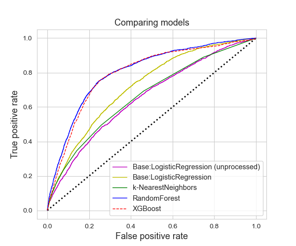
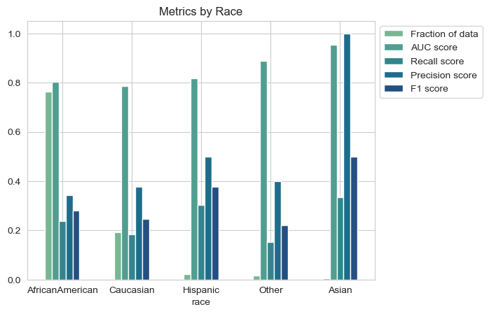
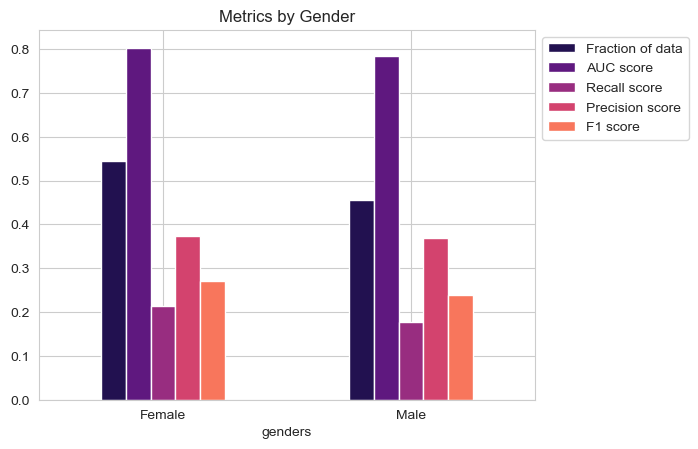
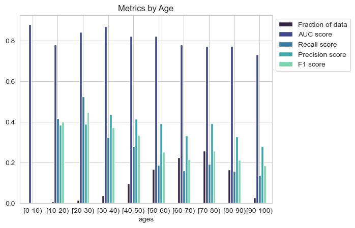

# Faircare Analytics

Team members: Kehinde Soetan, Ricky Lee, Tam Cheetham-West, Souradeep Thakur

## Introduction

Hospital readmissions are a major hurdle in healthcare and can be incredibly expensive. According to [this article](https://kffhealthnews.org/news/medicare-readmissions-penalties-2015/) based on 2014 Medicare data, approximately 2 million patients got readmitted within a year, with an estimated Medicare cost of $26 billion. It is however estimated that about $17 billion of that can be attributed to potentially preventable readmissions. High rates of readmission often signify issues with the quality of care received during initial stay, a lack of patient education, and suboptimal post-discharge support. In this project, we aim to
develop a machine learning model that predicts whether a patient is at risk of being readmitted based on their electronic health records (EHR).

## Dataset

Our [dataset](https://archive.ics.uci.edu/dataset/296/diabetes+130-us+hospitals+for+years+1999-2008) contains clinical care data from 130 US hospitals and integrated delivery networks spanning ten years (1999-2008). All patient records in the dataset correspond to patients diagnosed with diabetes who stayed up to 14 days in the hospital. The dataset contains 101,766 patient encounters and has 47 features. Here is a brief summary of the features:

| Feature      | Type | Description         | Missing |
| ------------ | ---- | ------------------- | ------- |
| encounter_id |  ID    | UID of an encounter |   No   |
| patient_nbr  |  ID    | UID of a patient |     No    |
| race | Categorical  | Demographic; values: Caucasian, Asian, AfricanAmerican, Hispanic, and other. | 2% |
| gender | Categorical | Demographic; values: male, female, and unknown/invalid | No |
| age | Categorical | Demographic; values binned as [0-10), [10-20), ..., [90-100) | No
| weight | Categorical | Weight in lbs. | 97% |
| admission_type_id | Categorical | Integer codes with 9 distinct values; for example, 1 = emergency. | No |
| discharge_disposition_id | Categorical | Integer codes with 29 distinct values; for example, 1 = discharged to home. | No |
| admission_source_id | Categorical | 21 distinct integer codes | No |
| time_in_hospital | Integer | Number of days between admission and discharge | No |
| payer_code | Categorical | 23 distinct integer codes | 52% |
medical_specialty | Categorical | 84 distinct integer codes; indicates the specialty of the admitting physician. | 53% |
| num_lab_procedures | Integer | Number of lab tests undergone during the encounter. | No |
| num_procedure | Integer | Number of non-lab procedures undergone during the encounter. | No |
| num_medications | Integer | Number of distinct medications administered during the encounter. |
| num_outpatient | Integer | Number of outpatient visits in the year preceding the encounter. | No |
| number_emergency | Integer | Number of emergency visits in the past year preceding the encounter. | No |
| number_inpatient | Integer | Number of inpatient visits in the year preceding the encounter. | No |
| diag_1 | Categorical | Primary diagnosis: first three characters of ICD9 diagnosis codes (848 distinct values). | <1% |
| diag_2 | Categorical | Secondary diagnosis: first three characters of ICD9 diagnosis codes (923 distinct values). | <1% |
| diag_3 | Categorical | Additional secondary diagnosis: first three characters of ICD9 diagnosis codes (954 distinct values). | 1% |
| number_diagnosis | Categorical | Number of diagnosis in the system. | No |
| max_glu_serum | Categorical | Test result with values: >200, >300, Norm (normal), and None if not measured. | No |
| A1Cresult | Categorical | HbA1c test result; values: >7%, >8%, Norm, and None if not measured. | No |
| 23 drug features (e.g.- metformin, insulin, etc.) | Categorical | Values: up=dosage increased, steady=dosage unchanged,   down=dosage decreased, None=not prescribed.| No |

The dataset was originally introduced and used in the paper: [Impact of HbA1c Measurement on Hospital Readmission Rates: Analysis of 70,000 Clinical Database Patient Record](http://www.hindawi.com/journals/bmri/2014/781670/). It has since been incorporated into the ucimlrepo package.

## Data Processing

We drop the features: weight, payer_code, and medical_specialty since they missing more than 50% of the values. Additionally, a total of 16 drugs in the dataset were never prescribed for over 95% of all encounters; we drop these as well.

### Exploratory data analysis

Here is how the data is distributed over the target and demographic features.

The main objectives of our EDA are to identify any notable correlations between different features and readmissions.

None of the features seem to be significantly correlated to others. The only exceptions are the features time_in_hospital and num_medication. We also established that the industry standard codes such as admission_type_id, discharge_disposition_id, admission_source_id and the ICD9 diagnosis codes have no correlation with the severity of a patients condition, or readmission frequency.

### Feature engineering 

#### Grouping codes

We group the features admission_type_id, discharge_disposition_id, admission_source_id, diag_1, diag_2, and diag_3. The diagnosis codes appear as the first three characters of the alphanumeric [ICD9 codes](https://en.wikipedia.org/wiki/List_of_ICD-9_codes). We group these diagnosis codes into 19 distinct categories by medical specialty such as, circulatory, respiratory, digestive, infections, etc. The other industry standard codes are also grouped into sensible categories. For instance, admission_type_id (refers to the reason and urgency for a patient's hospital admission) is grouped into urgent care, non-urgent care, and unknown.

#### Integer encodings
Some of the categorical variables such as race and gender are one-hot encoded. We encode the ages as follows, [0-10) as 0, [10-20) as 1, [20-30) as 3, and so on. The drug features (metformin, repaglinide, etc.) have four distinct values: up, steady, down, and no which correspond to dosage being increased, unchanged, decreased and not prescribed respectively. We encode these as follows, up as 3, steady as 2, down as 1, and no as 0. Similarly, the test result variables, A1Cresult (HbA1c test result) and max_glu_serum (maximum glucose serum test) have four distinct values. Take max_glu_serum for instance. The four distinct values are encoded as follows, >300 mg/dL as 3, >200 mg/dL as 2, Norm (~120 mg/dL) as 1, and No (test not performed) as 0.

#### Additional features

While the dataset contains $\sim 10^{5}$ data points, these correspond to only $\sim 7\times 10^{4}$ distinct patients (mentioned in this [paper](http://www.hindawi.com/journals/bmri/2014/781670/) and this [project](https://github.com/lelandburrill/diabetes_readmission)). This allowed us to add some patient historical features. For example, we added the number of distinct diagnoses a patient has had as well as the total time spent in hospitals. We added an additional 13 features corresponding to diagnoses that correspond to the highest number of readmissions within 30 days.

## Models and Results
### Models
Here is a list of the models that we used:
- Logistic regression (base model)
- k-Nearest Neighbors (k-NN) classifier
- XGBoost classifier
- RandomForest classifier
### Results
### _Binary classification: <30 day readmit_
Here is a summary of the results (class 1 corresponds to readmitted in <30 days).
| Model | MSE | AUC score | Accuracy | Precision | Recall | F1-score |
|-------|-----|----------|-----------|-----------|--------|----------|
|Baseline: Logistic regression| 0.1168 | 0.7193 | 0.8832| 0 : 0.89 1 : 0.39 | 0 : 0.99 1 : 0.04 | 0 : 0.94 1 : 0.07 |
| k-NN | 0.1148 | 0.6640 | 0.8852 | 0 : 0.89 1 : 0.48 | 0 : 1.00  1 : 0.02 | 0 : 0.94 1 : 0.04 |
| RandomForest | 0.1146 | 0.8034 | 0.8854 | 0 : 0.89 1 : 0.50 | 0 : 0.99  1 : 0.10 | 0 : 0.94 1 : 0.17 |
| Final: XGBoost | 0.1301 | 0.7937 | 0.8699 | 0 : 0.90 1 : 0.37 | 0 : 0.96 1 : 0.20 | 0 : 0.93 1 : 0.26 |

#### Final model:
 Extensive feature engineering and model optimization revealed the none of the models were well suited for specifically identifying patients readmitted within 30 days. Due to the extreme imbalance in the target, we attempted to optimize the models prioritizing recall. The calibrated XGBoost was the best performing model in this regard. k-NearestNeighbors was the worst performing model, only managing to outperform the baseline model on unprocessed data. Here is a comparison of all the models (optimized prioritizing recall),

We also wanted to ensure that the model does not have biases towards different demographic groups. For instance, the races of the patients in the dataset are extremely imbalanced. Here is a glimpse at different metrics for different demographic groups,

Analysis of the metrics reveals comparable distributions across gender and racial classifications. However, significant variations are noted when examining age groups.

### _Ternary classification_

We attempted a three-way classification using XGBoost. Here are the classes: (0 = Not readmitted, 1 = readmitted in >30 days, 2 = readmitted in <30 days). The model exhibited clear signs of overfitting, achieving a recall score of 0.26 (for class 2) on the training data but failing to predict a single <30 day readmissions in the test dataset.

### _Binary classification: Balanced classes_

Our models do a decent job of classifying between readmitted (1) and not readmitted (0). Here is a summary of the results.

| Model | MSE | AUC score | Accuracy | Precision | Recall | F1-score |
|-------|-----|----------|-----------|-----------|--------|----------|
|Baseline: Logistic regression| 0.2463 | 0.8086 | 0.7537 | 0 : 0.72 1 : 0.81 | 0 : 0.87 1 : 0.63 | 0 : 0.79 1 : 0.71 |
| k-NN | 0.3176 | 0.7456 | 0.6824 | 0 : 0.65 1 : 0.75 | 0 : 0.86  1 : 0.49 | 0 : 0.74 1 : 0.59 |
| RandomForest | 0.2036 | 0.8576 | 0.7964 | 0 : 0.78 1 : 0.82 | 0 : 0.86  1 : 0.73 | 0 : 0.82 1 : 0.77 |
| XGBoost | 0.1889 | 0.8765 | 0.8111 | 0 : 0.78 1 : 0.87 | 0 : 0.90 1 : 0.71 | 0 : 0.83 1 : 0.78 |

## Future Steps
1. Improve recall for <30 day readmits. This is a notoriously hard problem currently under active research ([paper](https://www.cell.com/iscience/fulltext/S2589-0042(24)01506-2) from 2024). We intend to use deep reinforcement learning to perform a similar classification.
2. Use the model on [MIMIC-III](https://physionet.org/content/mimiciii/1.4/) and [MIMIC-IV](https://physionet.org/content/mimiciv/). Both of these are large and robust datasets and would probably lead to a significantly improved model.

## Repo details

*data/* : Contains all data files used or generated throughout the project. They are all in CSV format.

*figs/* : Contains plots and figures generated from different notebooks for <30 day readmit classification. Some of these figures are used in the README.

*figs/plot_data/* : Contains some additional data used to create plots.

*balanced_class/* : Contains notebooks, figures and plot data for balanced and three-way classifications.

*deliverables/* : Contains the final presentation slides and the executive summary.
