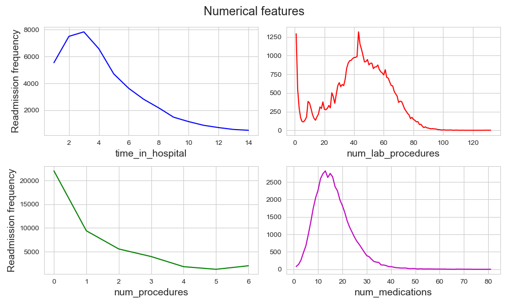

# Faircare Analytics

Team members: Kehinde Soetan, Ricky Lee, Tam Cheetham-West, Souradeep Thakur

## Introduction

Hospital readmissions are a major hurdle in healthcare and can be incredibly expensive. According to [this article](https://kffhealthnews.org/news/medicare-readmissions-penalties-2015/) based on 2014 Medicare data, approximately 2 million patients got readmitted within a year, with an estimated Medicare cost of $26 billion. It is however estimated that about $17 billion of that can be attributed to potentially preventable readmissions. High rates of readmission often signify issues with the quality of care received during initial stay, a lack of patient education, and suboptimal post-discharge support. In this project, we aim to
develop a machine learning model that predicts whether a patient is at risk of being readmitted or not, based on their electronic health records (EHR).

## Dataset

Our [dataset](https://archive.ics.uci.edu/dataset/296/diabetes+130-us+hospitals+for+years+1999-2008) contains clinical care data from 130 US hospitals and integrated delivery networks spanning ten years (1999-2008). All patient records in the dataset correspond to patients diagnosed with diabetes who stayed up to 14 days in the hospital. The dataset contains 101766 patient encounters and has 47 features. Here is a brief summary of the features:

| Feature      | Type | Description         | Missing |
| ------------ | ---- | ------------------- | ------- |
| encounter_id |  ID    | UID of an encounter |   No   |
| patient_nbr  |  ID    | UID of a patient |     No    |
| race | Categorical  | Demographic; values: Caucasian, Asian, AfricanAmerican, Hispanic, and other. | 2% |
| gender | Categorical | Demographic; values: male, femaile, and unknown/invalid | No |
| age | Categorical | Demographic; values binned as [0-10), [10-20), ..., [90-100) | No
| weight | Categorical | Weight in lbs. | 97% |
| admission_type_id | Categorical | Integer codes with 9 distinct values; for example, 1 = emergency. | No |
| discharge_disposition_id | Categorical | Integer codes with 29 distinct values; for example, 1 = discharged to home. | No |
| admission_source_id | Categorical | 21 distinct integer codes | No |
| time_in_hospital | Integer | Number of days between admission and discharge | No |
| payer_code | Categorical | 23 distinct integer codes | 52% |
medical_specialty | Categorical | 84 distinct integer codes; indicates the specialty of the admitting physician. | 53% |
| num_lab_procedures | Integer | Number of lab tests undergone during the encounter. | No |
| num_procedure | Integer | Number of non-lab procedures undergone during the encounter. | No |
| num_medications | Integer | Number of distinct medications administered during the encounter. |
| num_outpatient | Integer | Number of outpatient visits in the year preceding the encounter. | No |
| number_emergency | Integer | Number of emergency visits in the past year preceding the encounter. | No |
| number_inpatient | Integer | Number of inpatient visits in the year preceding the encounter. | No |
| diag_1 | Categorical | Primary diagnosis: first three characters of ICD9 diagnosis codes (848 distinct values). | <1% |
| diag_2 | Categorical | Secondary diagnosis: first three characters of ICD9 diagnosis codes (923 distinct values). | <1% |
| diag_3 | Categorical | Additional secondary diagnosis: first three characters of ICD9 diagnosis codes (954 distinct values). | 1% |
| number_diagnosis | Categorical | Number of diagnosis in the system. | No |
| max_glu_serum | Categorical | Test result with values: >200, >300, Norm (normal), and None if not measured. | No |
| A1Cresult | Categorical | HbA1c test result; values: >7%, >8%, Norm, and None if not measured. | No |
| 23 drug features (e.g.- metformin, insulin, etc.) | Categorical | Values: up=dosage increased, steady=dosage unchanged,   down=dosage decreased, None=not prescribed.| No |

The dataset was originally introduced and used in the paper: [Impact of HbA1c Measurement on Hospital Readmission Rates: Analysis of 70,000 Clinical Database Patient Record](http://www.hindawi.com/journals/bmri/2014/781670/). It has since been incorporated into the ucimlrepo package.

## Data Processing

We drop the features: weight, payer_code, and medical_specialty since they missing more than 50% of the values. Additionally, a total of 16 drugs in the dataset were never prescribed for over 95% of all encounters; we drop these as well.

### Exploratory data analysis

The main objectives of our EDA are to visualize any notable correlations between different features and readmissions. We also check if the features themselves are correlated to others. 

### Feature engineering 

## Models and Results
### Models
- Logistic regression (base model)
- kNN
- XGBoost
- RandomForest
### Results
Here is a summary of the results.

### Final model

## Future Prospects
1. 
2. 

## Guide to Repo
1. 
2. 

## References